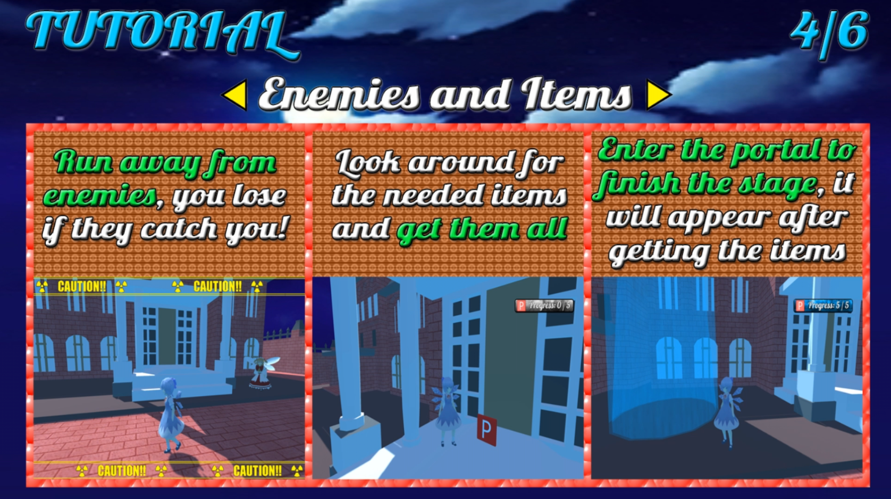
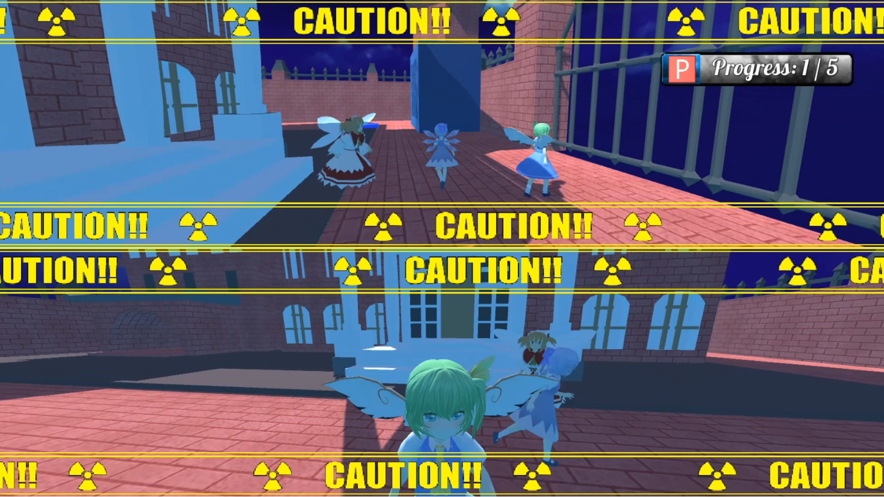
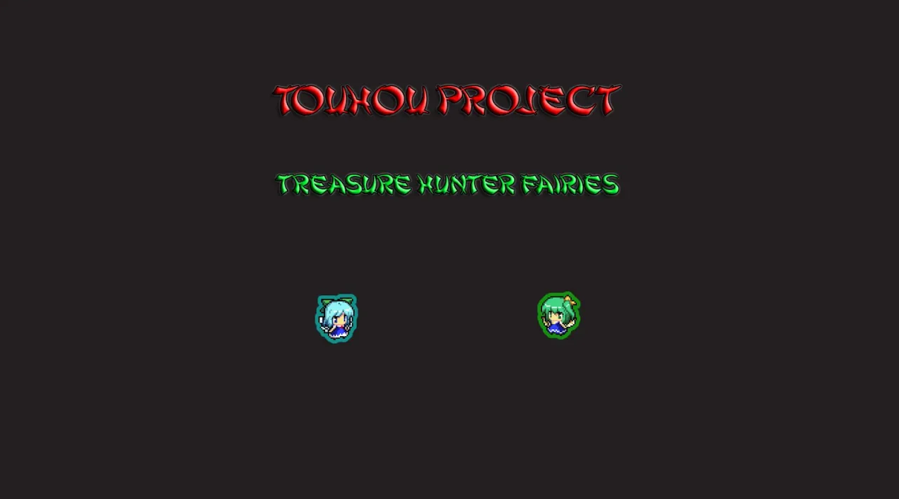

# Touhou Fangame - Treasure Hunter Fairies
Welcome everybody. This repository is to host a little Touhou fangame I made back in 2020. This game is completely free and I don't own anything from Touhou Project mark, all rights are reserved to ZUN and Team Shangai Alice.
- It's a local coop 3D platform game up to 2 players at the same time. 
- One quiet day, a competition was held on fairy forest to see who was the fastest, unfortunately Cirno was last, so now she must travel to different Gensokyo's places looking for goodies while other fairies try to prevent it. 
- The game has ten stages and autosaves when you clear a stage, if you get caught you have to restart that stage (on coop both players have to get caught).
- Default controls for keyboard are WASD keys to move, space bar to jump, left shift to run, camera movement with mouse and P to pause the game (you can change the jump and pause key).
- Second player needs a controller to play, being the left joystick used to move, right stick and left/right bumpers for camera movement, A to jump, X to run and Start to pause (on a Xbox controller). 

Here's some screenshots of the game:

  

  

  

You can also watch a full coop gameplay if you want [here](https://youtu.be/c7Nvh4yX_pg)

  

